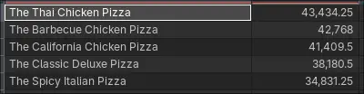

# 🍕 Pizzeria Sales Data Analysis

## 📌 Project Overview.

This project analyzes a fictional pizzeria’s sales data using **PostgreSQL (in Docker)** for data storage, and **Power BI** for visualization and transformation.

The goal is to provide the “client” (the pizzeria’s management team) with **actionable insights** into sales performance, customer behavior, and product trends.

The final deliverable is a **Power BI interactive dashboard** that answers the client’s key business questions and visualizes important metrics.

> ℹ️ Note: This project was inspired by a [YouTube tutorial](https://www.youtube.com/watch?v=V-s8c6jMRN0), which I used as a foundation to explore end-to-end data analysis with PostgreSQL and Power BI.
> I made several changes, including the tech stack, modifying SQL queries, and customizing the dashboard design.
> The **Key Insights** were also written by me and embedded directly in the Power BI dashboard.

---

## 📊 Live Dashboard

**The latest version of the dashboard is always available here:**
[View Live Power BI Dashboard](https://app.powerbi.com/links/O5Owxy0jUt?ctid=6f0348f2-e498-45c9-84f4-c6d81dcffdfe&pbi_source=linkShare)

---

## 🚀 Tech Stack

- **Database:** PostgreSQL (running in Docker).
- **Database Management:** DBeaver.
- **Queries:** SQL.
- **Visualization:** Power BI.
- **Dataset:** Pizza sales transactional data (pizza_id, order_id, pizza_name_id, quantity, order_date, order_time, unit_price, total_price, pizza_size, pizza_category, pizza_ingredients, pizza_name).

---

## 🎯 Business Problem

The pizzeria wants to monitor **key performance indicators (KPIs)** and explore **sales trends** to make better decisions about menu offerings, pricing, and promotions.

---

## 📊 KPI Requirements

1. **Total Revenue** – sum of the total price of all pizza orders.
2. **Average Order Value** – total revenue by the total number of orders.
3. **Total Pizzas Sold** – sum of the quantities of all pizzas sold.
4. **Total Orders** – total number of orders placed.
5. **Average Pizzas per Order** – total number pizzas sold by total number of orders.

---

## 📈 Charts & Insights

1. **Daily Trend for Total Orders** – bar chart showing daily order volume.
2. **Monthly Trend for Total Orders** – line chart showing order patterns over time.
3. **Sales by Pizza Category** – pie chart distribution of sales across different pizza categories.
4. **Sales by Pizza Size** – donut chart distribution of sales across different pizza sizes.
5. **Pizzas Sold by Category** – funnel chart for total number of pizzas sold for each pizza category.
6. **Top 5 Best Sellers** – bar chart by total revenue, total quantity, and total orders.
7. **Top 5 Worst Sellers** – bar chart by total revenue, total quantity, and total orders.

---

## 🗂️ Project Structure

```bash
SQL-PowerBI-Project
├── 01-KPIsRequirements.sql
├── 02-ChartRequirements.sql
├── data
│   └── pizza_sales.csv
├── docker-compose.yml
├── images
│   ├── Charts
│   │   └── *.webp
│   ├── Dashboard
│   │   └── *.webp
│   └── KPI
│       └── *.webp
├── init.sql
└── README.md
```

## ⚙️ Local Setup Instructions

### Prerequisites

- Docker & Docker Compose
- DB manager of your preference (compatible with PostgreSQL).

1. **Clone the repo**

```bash
git clone https://github.com/AaronOrtega1/SQL-PowerBI-Project.git
cd SQL-PowerBI-Project
```

2. **Start PostgreSQL with Docker**

```bash
docker compose up -d
```

3. **The `docker-compose.yml` file automatically creates the Database, creates the table and loads the data**
4. **Connect with your database manager of preference to the PostgreSQL DB using the information in the `docker-compose.yml` file.**
5. **To create a dashboard of your own, you have to connect the PostgreSQL DB to Power BI desktop also using the information in the `docker-compose.yml` file.**

---

## 📷 Screenshots

<!-- KPIs -->
<details>
  <summary><h3>KPI Results (SQL Queries)</h3></summary>
  <ol>
    <li>
      <b>Total Revenue</b><br />
      <pre>SELECT SUM(ps.total_price) AS total_revenue FROM pizza_sales ps;</pre>
      
    </li>
    <li>
      <b>Average Order Value</b><br />
      <pre>
SELECT (SUM(ps.total_price) / COUNT(DISTINCT ps.order_id)) AS avg_order_value FROM pizza_sales ps;</pre
      >
      
    </li>
    <li>
      <b>Total Pizzas Sold</b><br />
      <pre>SELECT SUM(ps.quantity) AS total_pizzas_sold FROM pizza_sales ps;</pre>
      
    </li>
    <li>
      <b>Total Orders</b><br />
      <pre>SELECT COUNT(DISTINCT ps.order_id) AS total_orders FROM pizza_sales ps;</pre>
      
    </li>
    <li>
      <b>Average Pizzas Per Order</b><br />
      <pre>
SELECT CAST(SUM(ps.quantity) AS DECIMAL(10,2)) / CAST(COUNT(DISTINCT ps.order_id) AS DECIMAL(10,2)) AS avg_pizzas_per_order FROM pizza_sales ps;</pre
      >
      
    </li>
  </ol>
</details>

<!-- Charts -->
<details>
  <summary><h3>Chart Requirements Results (SQL Queries)</h3></summary>
  <ol>
    <li>
      <b>Daily Trend for Total Orders</b><br />
      <pre>
SELECT
	TO_CHAR(ps.order_date, 'Day') as order_day,
	COUNT(DISTINCT ps.order_id) as total_orders
FROM pizza_sales AS ps
GROUP BY TO_CHAR(ps.order_date, 'Day'), EXTRACT(DOW FROM ps.order_date)
ORDER BY EXTRACT(DOW FROM ps.order_date)</pre
      >
      
    </li>
    <li>
      <b>Monthly Trend for Total Orders</b><br />
      <pre>
SELECT
	TO_CHAR(ps.order_date, 'Month') as order_month,
	COUNT(DISTINCT ps.order_id) as total_orders
FROM pizza_sales AS ps
GROUP BY TO_CHAR(ps.order_date, 'Month'), EXTRACT(MONTH FROM ps.order_date)
ORDER BY EXTRACT(MONTH FROM ps.order_date);</pre
      >
      
    </li>
    <li>
      <b>Percentage of Sales by Pizza Category</b><br />
      <pre>
SELECT
	ps.pizza_category,
	SUM(ps.total_price) AS total_sales,
	CAST(SUM(ps.total_price)*100/(SELECT SUM(total_price) FROM pizza_sales WHERE EXTRACT(MONTH FROM order_date) = 1) AS DECIMAL(10,2)) AS pct
FROM pizza_sales AS ps
WHERE EXTRACT(MONTH FROM ps.order_date) = 1
GROUP BY ps.pizza_category;</pre
      >
      
    </li>
    <li>
      <b>Percentage of Sales by Pizza Size</b><br />
      <pre>
SELECT
	ps.pizza_size,
	SUM(ps.total_price) AS total_sales,
	CAST(SUM(ps.total_price)*100/(SELECT SUM(total_price) FROM pizza_sales) AS DECIMAL(10,2)) AS pct
FROM pizza_sales AS ps
GROUP BY ps.pizza_size;</pre
      >
      
    </li>
    <li>
      <b>Total Pizzas Sold by Pizza Category</b><br />
      <pre>
SELECT
	ps.pizza_category,
	SUM(ps.quantity) AS sold_pizzas
FROM pizza_sales AS ps
GROUP BY ps.pizza_category;</pre
      >
      
    </li>
    <li>
      <b>Top 5 Best Sellers by Revenue, Total Quantity and Total Orders</b><br />
      <pre>
SELECT
	ps.pizza_name,
	SUM(ps.total_price) AS revenue
FROM pizza_sales AS ps
GROUP BY ps.pizza_name
ORDER BY revenue DESC
LIMIT 5;</pre
      >
      
    </li>
    <li>
      <b>Top 5 Worst Sellers by Revenue, Total Quantity and Total Orders</b><br />
      <pre>
SELECT
	ps.pizza_name,
	SUM(ps.total_price) AS revenue
FROM pizza_sales AS ps
GROUP BY ps.pizza_name
ORDER BY revenue
LIMIT 5;</pre
      >
      
    </li>
  </ol>
</details>

<!-- Dashboard -->

<details>
  <summary><h3>Power Bi Dashboard</h3></summary>
  <ol>
    <li>
      <b>Home</b><br />
      
    </li>
    <li>
      <b>Best/Worst Sellers</b><br />
      
    </li>
  </ol>
</details>

---

## Author

- [Francisco Aarón Ortega Anguiano](https://www.linkedin.com/in/francisco-aar%C3%B3n-ortega-anguiano-63109022a/) – Computer Systems Engineering Student
